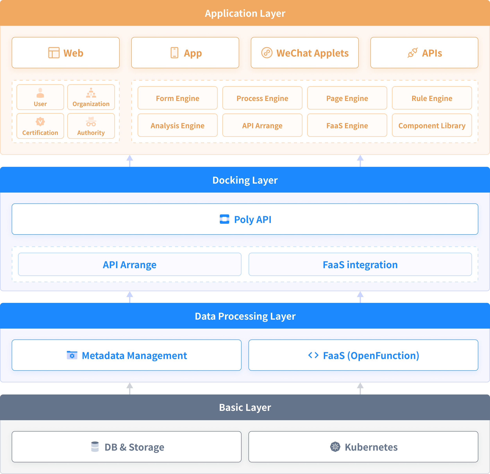

  

   
  <a href="https://quanxiang.dev" target="blank">
    QuanXiang
  </a>

  <b>QuanXiang is a powerful, pluggable open source low-code platform.</b>

> English| [中文](./README_zh.md)

  <h3>
    Website
     | 
    Demo
     | 
    Documentation
     | 
    Guide
     | 
    <a href="https://github.com/quanxiang-cloud/quanxiang/discussions" target="_blank">Community</a>
  </h3>

## Introduction

QuanXiang is a cloud-native, fully containerized, open source, low-code platform used to assist in building various types of digital applications for enterprises. The platform currently provides two application development modes: no-code and low-code on the cloud, and supports visual design, allowing developers and business users to quickly complete application development through simple drag-and-drop and parameter configuration. As a multi-application integration and management platform integrating low-code development capability, identity authentication capability and container DevOps capability, QuanXiang supports rapid application building, easy maintenance and management of applications, integration of enterprise stock business and full-image cloud building business.

## Features

QuanXiang builds a low-code ecosystem around application design, development, deployment, operation and maintenance. The core capabilities of the platform are as follows:

  
<b> 🚀 Rapid application development</b>

  <li>Visual designer: Users can complete form, workflow, data_models, and permissions through simple drag and drop, parameter configuration, etc.
  <li>Form engine: Provides rich page components.
  <li>Workflow engine: Supports a variety of triggering methods and process components, and provides the ability of a rule engine to meet the logic definitions of complex businesses.
  

  
<b>☁️ Cloud deployment operation and maintenance</b>

  <li>QuanXiang is based on Kubernetes deployment, CI/CD continuous delivery deployment.
  <li>Support the deployment and operation and maintenance of different cloud vendors.
  <li>Provide system log, support to view all operation records.
  

  
<b>🤖 Multi-terminal adaptation</b>

  Apply one-time design and adapt flexibly to multiple ends. Support one-click publishing as WEB App, Native App, WeChat Applet.
  

  
<b>🧑‍💻 Organization management</b>

  <li>Corporate directory: Provide a variety of ways to manage the corporate directory to help companies quickly build an organization.
  <li>Role management: Enterprise role permissions are subdivided to ensure platform account access security and data security.

  
<b>🗂 System connectivity</b>

  <li>Supports data connection between applications, providing data connection capabilities of different granularity, for example, data linkage update between tables and interaction between fields.
  <li>Provide solution integration of different granularities, such as: component integration, page integration, application integration.
  

  
<b>🧩 Pluggable open source</b>

  QuanXiang is a cloud native, distributed architecture platform system. Core services (except for aggregated services) are completely decoupled and low cohesive, and services are accessed through API interfaces.
  

## Architecture

QuanXiang uses a loosely-coupled architecture that separates the frontend from the backend. It provides a plug-and-play, microservices architecture and embraces the diversity of languages and developer frameworks. The platform is divided into: application layer, docking layer, data processing layer and basic layer.

## Installation

QuanXiang privodes a deployment tool, which can help user to quckly deploy QuanXiangCloud low-code platform with a single line of command . QuangXiang deployment tool support most of popular K8S release, currently supported for installation in KubeSphere environments.

[✨ Installing on a Kubesphere environment](./doc/install.md)

## Get Started using QuanXiang

See our [Getting Started](https://quanxiang.dev/quickstart/app_modeling/) guide over in our docs.

## Component Open Source Project

|  Service   | Function  | Planned open source date |
|  ----  | ---- | ---- |
| [structor](https://github.com/quanxiang-cloud/structor) | It's a abstract layer between bussiness layer and database, that will make users easy to use database without database knowledge.  | 2022/5/17 |
| process | Process engine kernel: process model definition, process scheduling and instance data logging. | 2022/6/6 |
| persona | Application Configuration Center: Application personalized configuration data storage. | 2022/7/1 |
| kms | Key management: platform key management and signature verification, external key proxy and authentication. | To be determined |

## Interaction

- 💬 [Twitter](https://twitter.com/QuanXiang5)
- 🤖 [Slack Channel](https://quanxiangcloud.slack.com/join/shared_invite/zt-17p7ne6h3-WtDNV72vnQ0vl8pdeLxABg)
- 🙌 [Forum](https://github.com/quanxiang-cloud/quanxiang/discussions)
- 💬 WeChat Group

