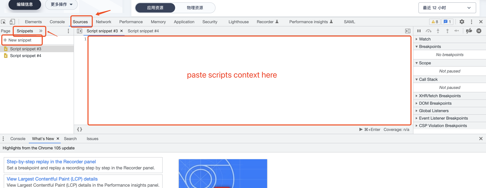

<p align="center">
  <a href="https://docs.clouden.io" target="blank"></a>
</p>
<p align="center">
  <br/>
  <a href="https://docs.clouden.io" target="blank">
    QuanXiang
  </a>
</p>
<p align="center">
  <b>QuanXiang is a powerful, pluggable open source low-code platform.</b>
</p>


> English| [中文](./README_zh.md)

[](https://github.com/quanxiang-cloud/website/tree/main/content/en/roadmap)
[]()
[](https://github.com/quanxiang-cloud/quanxiang/releases/tag/v1.1.0)
[](https://github.com/quanxiang-cloud/quanxiang/graphs/contributors)
[](https://github.com/quanxiang-cloud/quanxiang/issues)
[](https://github.com/quanxiang-cloud/quanxiang)
[](https://github.com/quanxiang-cloud/quanxiang)
[](https://twitter.com/QuanXiang5)


<div align="center">
  <h3>
    Website
    <span> | </span>
    Demo
    <span> | </span>
    Documentation
    <span> | </span>
    Guide
    <span> | </span>
    <a href="https://github.com/quanxiang-cloud/quanxiang/discussions" target="_blank">Community</a>
  </h3>
</div>


## Introduction

QuanXiang is a cloud-native, fully containerized, open source, low-code platform used to assist in building various types of digital applications for enterprises. The platform currently provides two application development modes: no-code and low-code on the cloud, and supports visual design, allowing developers and business users to quickly complete application development through simple drag-and-drop and parameter configuration. As a multi-application integration and management platform integrating low-code development capability, identity authentication capability and container DevOps capability, QuanXiang supports rapid application building, easy maintenance and management of applications, integration of enterprise stock business and full-image cloud building business.


## Features

QuanXiang builds a low-code ecosystem around application design, development, deployment, operation and maintenance. The core capabilities of the platform are as follows:

<details>
  <summary><b> 🚀 Rapid application development</b></summary>
  <li>Visual designer: Users can complete form, workflow, data_models, and permissions through simple drag and drop, parameter configuration, etc.
  <li>Form engine: Provides rich page components.
  <li>Workflow engine: Supports a variety of triggering methods and process components, and provides the ability of a rule engine to meet the logic definitions of complex businesses.
  </details>

<details>
  <summary><b>☁️ Cloud deployment operation and maintenance</b></summary>
  <li>QuanXiang is based on Kubernetes deployment, CI/CD continuous delivery deployment.
  <li>Support the deployment and operation and maintenance of different cloud vendors.
  <li>Provide system log, support to view all operation records.
  </details>

<details>
  <summary><b>🤖 Multi-terminal adaptation</b></summary>
  Apply one-time design and adapt flexibly to multiple ends. Support one-click publishing as WEB App, Native App, WeChat Applet.
  </details>

<details>
  <summary><b>🧑‍💻 Organization management</b></summary>
  <li>Corporate directory: Provide a variety of ways to manage the corporate directory to help companies quickly build an organization.
  <li>Role management: Enterprise role permissions are subdivided to ensure platform account access security and data security.
</details>
<details>
  <summary><b>🗂 System connectivity</b></summary>
  <li>Supports data connection between applications, providing data connection capabilities of different granularity, for example, data linkage update between tables and interaction between fields.
  <li>Provide solution integration of different granularities, such as: component integration, page integration, application integration.
  </details>


<details>
  <summary><b>🧩 Pluggable open source</b></summary>
  QuanXiang is a cloud native, distributed architecture platform system. Core services (except for aggregated services) are completely decoupled and low cohesive, and services are accessed through API interfaces.
  </details>


## Architecture

QuanXiang uses a loosely-coupled architecture that separates the frontend from the backend. It provides a plug-and-play, microservices architecture and embraces the diversity of languages and developer frameworks. The platform is divided into: application layer, docking layer, data processing layer and basic layer.


## Installation

QuanXiang privodes a deployment tool, which can help user to quckly deploy QuanXiangCloud low-code platform with a single line of command . QuangXiang deployment tool support most of popular K8S release, currently supported for installation in KubeSphere environments.

<details>
<summary><b>✨ Installing on a Kubesphere environment (recommended)</b></summary>

### Prerequisites

- Kubernetes cluster environment  v1.21.*
- OpenFunction v0.6.0

### Deploy QuanXiang on KubeShpere(recommend)

#### Step 1. Deploy KubeSphere and Openfunction

##### KubeSphere

- Deploy KubeSphere manully, refer [office documentation](https://kubesphere.io/docs/) for more details.
- Using [KubeSphere(R)（QKE） ](https://docsv3.qingcloud.com/container/qke/)(recommend) to deploy KubeShere cluster, which is high availability and support automatic inspection and repair.

KubeSphere cluster requirments:

| Node Type | Quantity | Resource Requirment                    |
| --------- | -------- | -------------------------------------- |
| Master    | 1        | CPU: 4 core, Memory: 8 GB, Disk: 80 GB |
| Worker    | 5        | CPU: 4 core, Memory: 8 GB, Disk: 80 GB |

##### OpenFunction

- Deploy Openfunction manully, refer [office documentation](https://openfunction.dev/docs/getting-started/installation/)


> **Notice**
>
> Scale nodes' resources to double and use PaaS that privode by cloud vendors, if you want to use QuanxiangCloud as production.


#### Step 2. QuanXiang installation

##### Prerequisite

Before deploying QuanXiang, below options are required in local environment:

- Accessible KubeSphere cluster.
- 'kubectl' is installed on local. refer [kubectl installation](https://kubernetes.io/docs/tasks/tools/) to install kubectl.
- Kubeconfig is configured. refer below steps to configure kubeconfig
  - Get QKE kubeconfig from QingCloud console.
  - For KubeSphere kubeconfig, refer to [documentation](https://kubernetes.io/docs/tasks/tools/) or ask [community](https://github.com/kubesphere) for more help.
- Helm3 is required. refer [helm3 installation](https://helm.sh/docs/intro/install/) to install helm3.

##### Download release

You can download the [release version](https://github.com/quanxiang-cloud/quanxiang/releases/tag/v1.1.0) directly. **QuanXiang privodes various architecture package.**

##### Build from source code

To build QianXiang deployment tool, that golang 1.16 is needed and special correct GOOS, GOARCH. Example command with Linux and amd64.

```bash
 git clone https://github.com/quanxiang-cloud/quanxiang.git
 cd quanxiang/deployment
 CGO_ENABLED=0 GOOS=linux GOARCH=amd64 go build -o installApp main.go
```

> **Notice**
>
> - GOOS: darwin, Linux, Windows, FreeBSD etc.
> - GOARCH: amd64, 386, arm etc.

#### Deploy QuanXiang

QuanxiangCloud deployment tool support production and demo:

- For production, database, cache, message etc. should be installed, refer [configurations](https://github.com/quanxiang-cloud/quanxiang/blob/master/doc/install.md#Configurations) for more details.
- For demo, all services will be deployed in Kubernetes.

##### Configurations

For production, you cat set `enable` to `false` to disable middle services in configuration file `configs/configs.yml` . refer to notes in configuration file for more details.

```bash
 vim configs/configs.yml
    #Middleware Services 中间件服务
    mysql:
      enabled: true
      rootPassword: qxp1234     #It is required to set the root user password if enabled equal to true    设置root用户密码 enabled为true时必填
    redis:
      enabled: true
      password: cXhwMTIzNA==    #The password here is the base64 code of the password. For example, the base64 code of qxp1234 is cxhwmjm0cg==  这里的password为密码的base64编码，比如qxp1234的base64编码为cXhwMjM0Cg==
    kafka:
              .....
```

##### Installation

Run `installApp` to install the trial version:

```bash
./installApp start -k ~/.kube/config  -i -n lowcode
```

Parameters description:

| parameter            | purpose                                                      | Description                                                  |
| -------------------- | ------------------------------------------------------------ | ------------------------------------------------------------ |
| -c/--configfile      | relative or absolute path of the configuration file          | Indicates the absolute or relative path of the current project configs / configs.yml |
| -d/--deploymentFile  | absolute or relative path of deployment folder               | absolute or relative path to the current project deployment folder |
| -k/--kubeconfig      | the profile path than can access to k8s cluster              | If the file is in the default location ~ /. Kube / config, you can not specify this parameter. |
| -i/--middlerwareInit | middleware initialization                                    | If specified, perform middleware initialization.             |
| -n/--namespace       | The namespace in which the service is deployed in the k8s cluster | If not specified, the default namespace is default.          |

##### Uninstall

```bash
./installApp uninstall -k ~/.kube/config -n lowcode
```

Parameters description:

| parameter                 | purpose                                                      | Description                                                  |
| ------------------------- | ------------------------------------------------------------ | ------------------------------------------------------------ |
| -d/--deploymentFile       | The path to the deployment folder                            | Absolute or relative path to the current project deployment folder. |
| -k/--kubeconfig           | the profile path than can access to k8s cluster              | If the file is in the default location ~ /. Kube / config, you can not specify this parameter. |
| -n/--namespace            | The namespace in which the service is deployed in the k8s cluster | If not specified, the default namespace is default.          |
| -u/--uninstallMiddlerware | Do you need to uninstall the middleware deployed by the tool | If there is no middleware deployed using this tool, you can not add this parameter. When the middleware is loaded and unloaded, it will be reported that there is no such resource and can be ignored. |


#### How to access

##### Configure gateway

Refer [KubeSphere official documentation](https://kubesphere.io/docs/project-administration/project-gateway/) to configure gateway. LoadBalancer is recommend.

##### Access QuanXiang

To access QuanxiangCloud console, you should configure your hosts file or add dns records into dns server. Use default admin user and password `admin@quanxiang.dev/654321a..` to login.

- Go to [http://portal.qxp.com](http://portal.qxp.com/) to access QuanxiangCloud administration console.
- Go to [http://home.qxp.com](http://home.qxp.com/) to access QuanxiangCloud client console.

> **Notice**
>
> Refer [KubeSphere office documentation](https://kubesphere.io/zh/docs/project-user-guide/application-workloads/routes/) to customize the domain.

##### initialize web configurations

Portal console does not initialize after installation, follow below steps to initialize:
>
> 1. Open QuanXiangCloud portal console by browser.
> 2. Open "Developer tool" in browser. MacOS  shortcut is "Option + command + I", Windows/Linux shortcut is "F12" or "Control + Alt + I"
> 3. Find "Sources" in "Developer tool" and chose "Snippets".
> 4. click "New snippet" and Paste scripts content one by one
>  **notice: scripts files' path is GITROOTDIR/deployment/scripts/**

Details please refer to the image:


</details>


<details>
<summary><b>💸 Installing on a native KuberNetes environment</b></summary>

Coming soon.

</details>

## Get Started using QuanXiang

See our [Getting Started](https://docs.clouden.io/quickstart/app_modeling/) guide over in our docs.

## Component Open Source Project

|  Service   | Function  | Planned open source date |
|  ----  | ---- | ---- |
| [structor](https://github.com/quanxiang-cloud/structor) | It's a abstract layer between bussiness layer and database, that will make users easy to use database without database knowledge.  | 2022/5/17 |
| process | Process engine kernel: process model definition, process scheduling and instance data logging. | 2022/6/6 |
| persona | Application Configuration Center: Application personalized configuration data storage. | 2022/7/1 |
| kms | Key management: platform key management and signature verification, external key proxy and authentication. | To be determined |

## Interaction

- 💬 [Twitter](https://twitter.com/QuanXiang5)
- 🤖 [Slack Channel](https://quanxiangcloud.slack.com/join/shared_invite/zt-17p7ne6h3-WtDNV72vnQ0vl8pdeLxABg)
- 🙌 [Forum](https://github.com/quanxiang-cloud/quanxiang/discussions)

